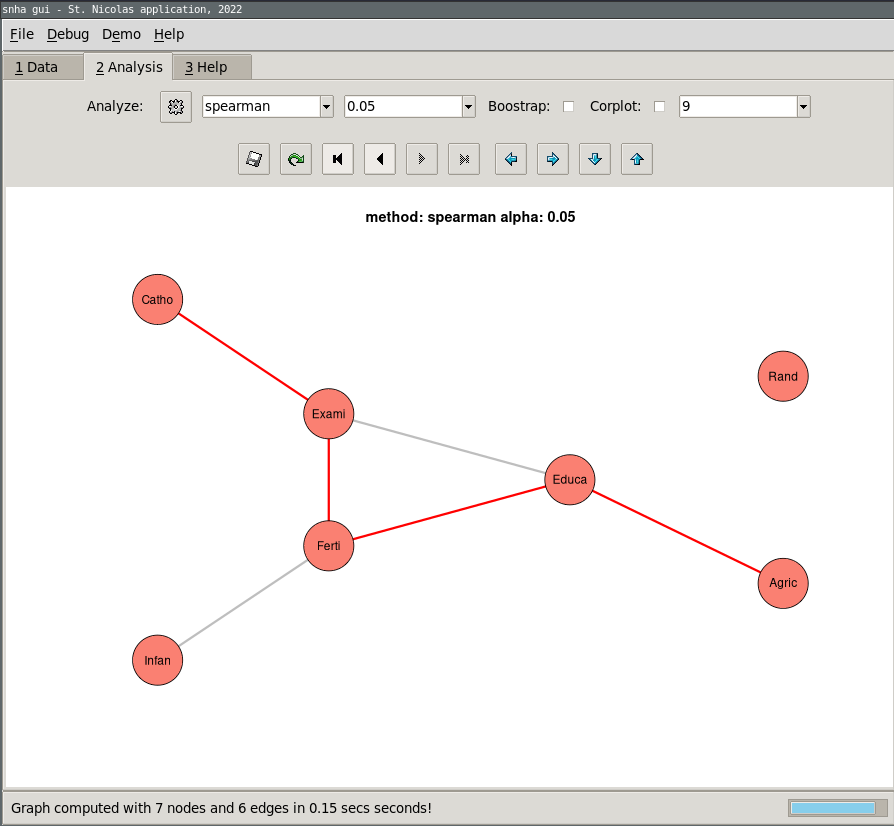

# snha-gui

This github pages host the GUI application and the R-library for the St.
Nicolas House Algorithm which allows to create correlation networks based on
association chains. For more background on the theory of this algorithm have a look at the following publications:

* Groth, D., Scheffler, C., & Hermanussen, M. (2019). Body height in stunted Indonesian children depends directly on parental education and not via a nutrition mediated pathway-Evidence from tracing association chains by St. Nicolas House Analysis. Anthr Anz, 76(5), 445-451. [DOI: 10.1127/anthranz/2019/1027](https://doi.org/10.1127/anthranz/2019/1027)
* Hermanussen, M., Aßmann, C., & Groth, D. (2021). Chain Reversion for Detecting Associations in Interacting Variables - St. Nicolas House Analysis. Int J Env Res Pub Health, 18(4), 1741. [DOI: 10.3390/ijerph18041741](https://doi.org/10.3390/ijerph18041741)

## St. Nicolas House Algorithm - Graphical User Interface



### Windows

For users which are not experienced R users there exists a graphical user
interface which can be installed either using the standalone single R-script
file or, for Windows systems, using a Windows installer which can be downloaded from here:

[snha-install.exe](https://github.com/mittelmark/snha-gui/raw/main/bin/snha-install.exe)

Experienced users might as well use the Unix script *snha-gui.Rz* mentioned below from a terminal.

### Unix / Linux / Mac-OSX

For Unix systems like Linux or Mac-OSX there is as well a single file application: [snha-gui.Rz](https://github.com/mittelmark/snha-gui/raw/main/bin/snha-gui.Rz)

Download this file and either run the file directly from a terminal with Rscript like this

```
Rscript /path/to/snha-gui.Rz
```

or make the file executable like this `chmod 755 snha-gui.Rz` and move this
file to a folder belonging to your PATH variable so that you can execute this
file from any folder by just typing `snha-gui.Rz` in the terminal. 

### Mac-OSX 

Please note, that on Mac-OSX you need usually to have a X-Server installation
for instance of [XQuartz](https://www.xquartz.org/) and you have to start the application from a
X-terminal. In some cases you might as well change the first line of the file
`snha-gui.Rz` so that it points to the right Rscript interpreter on your hard disk.

## Library

For advanced users as well the R-library can be download and installed
separately. It offers more features to modify the analysis and the graphical
output then the GUI but needs the usual knowledge of the R statisical programming language.

You can install the package directly from Github using the following lines of code from within your R-console:

```
URL="https://github.com/mittelmark/snha-gui/raw/main/lib/asg_0.8.0.tar.gz"
install.packages(URL,repos=NULL)
library(asg)
```

You should be then able to start to analyse your data like this:

```
data(swiss)
data=swiss # fill in your data
as=asg.new(data)
plot(as,layout="sam")
```

A good place to start is the help page of the *asg.new* function.

### TODO's

* repository asg for the library
* code release for the GUI

### Bugs

Please use the Github isses page to report problems and to give suggestions:

[https://github.com/mittelmark/snha-gui/issues](https://github.com/mittelmark/snha-gui/issues)

### License 

The code is released using the MIT license.

Copyright 2022, Detlef Groth, University of Potsdam, Germany

Permission is hereby granted, free of charge, to any person obtaining a copy
of this software and associated documentation files (the "Software"), to deal
in the Software without restriction, including without limitation the rights
to use, copy, modify, merge, publish, distribute, sublicense, and/or sell
copies of the Software, and to permit persons to whom the Software is
furnished to do so, subject to the following conditions:

The above copyright notice and this permission notice shall be included in all
copies or substantial portions of the Software.

THE SOFTWARE IS PROVIDED "AS IS", WITHOUT WARRANTY OF ANY KIND, EXPRESS OR
IMPLIED, INCLUDING BUT NOT LIMITED TO THE WARRANTIES OF MERCHANTABILITY,
FITNESS FOR A PARTICULAR PURPOSE AND NONINFRINGEMENT. IN NO EVENT SHALL THE
AUTHORS OR COPYRIGHT HOLDERS BE LIABLE FOR ANY CLAIM, DAMAGES OR OTHER
LIABILITY, WHETHER IN AN ACTION OF CONTRACT, TORT OR OTHERWISE, ARISING FROM,
OUT OF OR IN CONNECTION WITH THE SOFTWARE OR THE USE OR OTHER DEALINGS IN THE
SOFTWARE.


